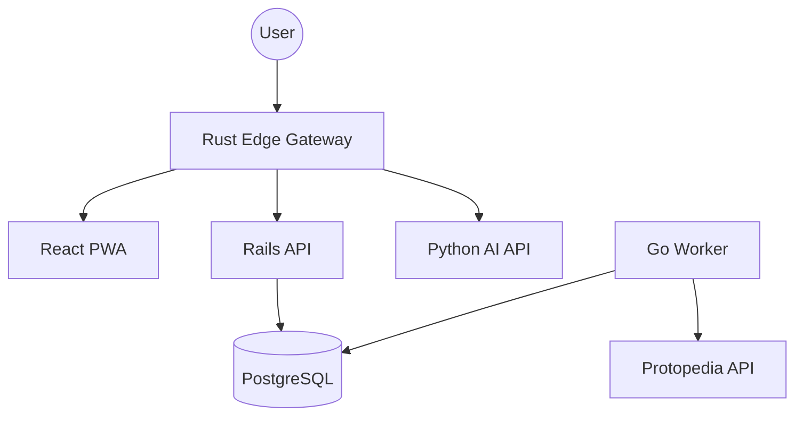

# Furukawa Archive OS Architecture

## System Overview
Furukawa Archive OS is a microservice-based portfolio platform designed for high performance, reliability, and engineering transparency.

## Component Responsibilities

- **Web (React/TS)**: High-fidelity PWA frontend. Optimized for OGP and accessibility.
- **API (Rails)**: Central data authority. Manages donations, blog metadata, and core resources.
- **Edge Gateway (Rust/Axum)**: Performance-oriented routing, rate limiting, and security.
- **Worker (Go)**: Efficient background synchronization. Handles Protopedia periodic updates every 6 hours.
- **AI (Python)**: Specialized service for future semantic enhancements (meaning-making analysis).

## Data Flow
1. **Content**: Managed via Markdown/YAML in Git. Reflected on Netlify/VPS via push hooks.
2. **Works**: Periodically synced from Protopedia by the Go Worker into PostgreSQL. Served via Rails API with static fallbacks for extreme reliability.
3. **Donations**: Stripe Checkout flow with webhook confirmation logged in PostgreSQL.
